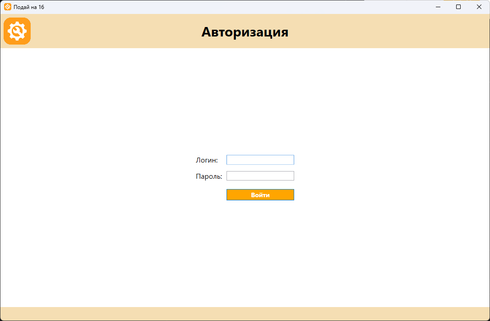
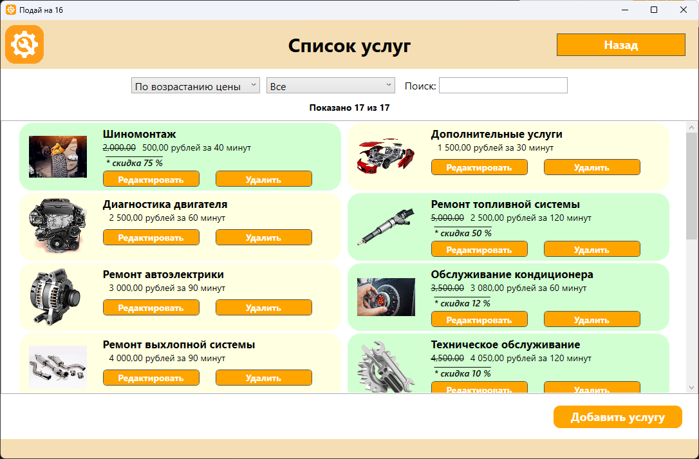
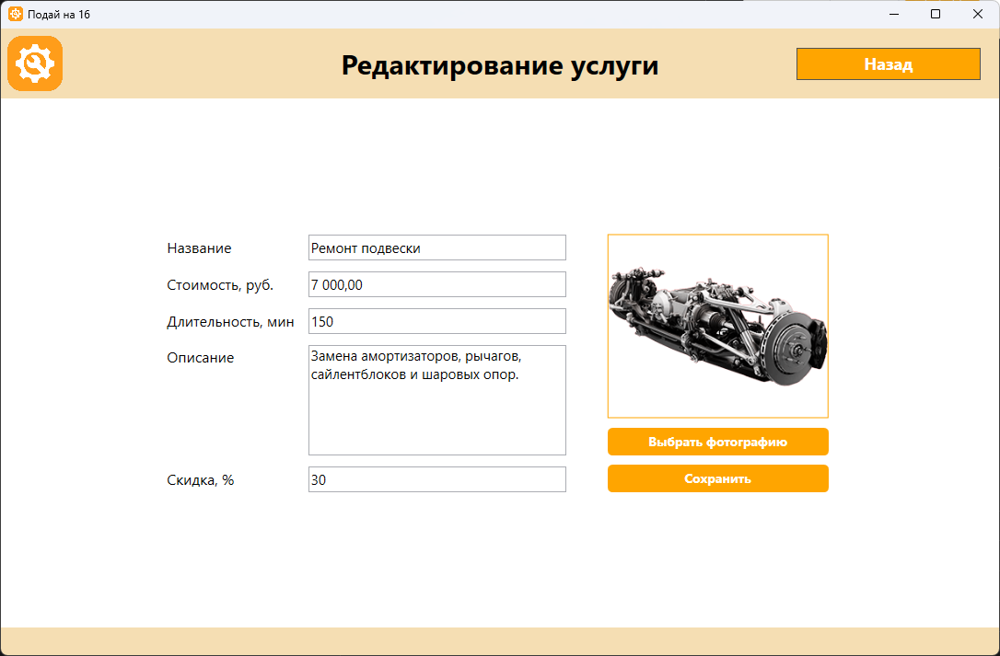
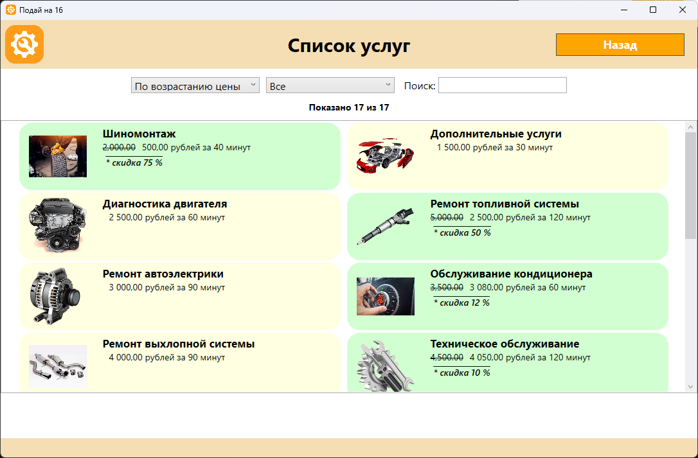
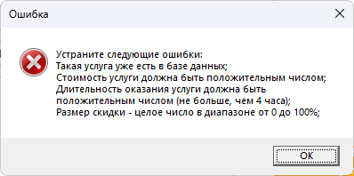
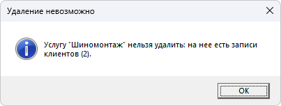
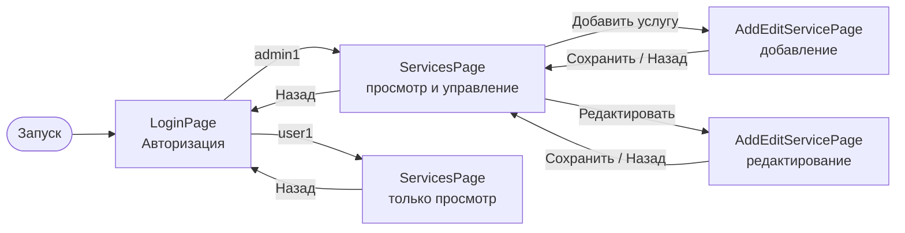
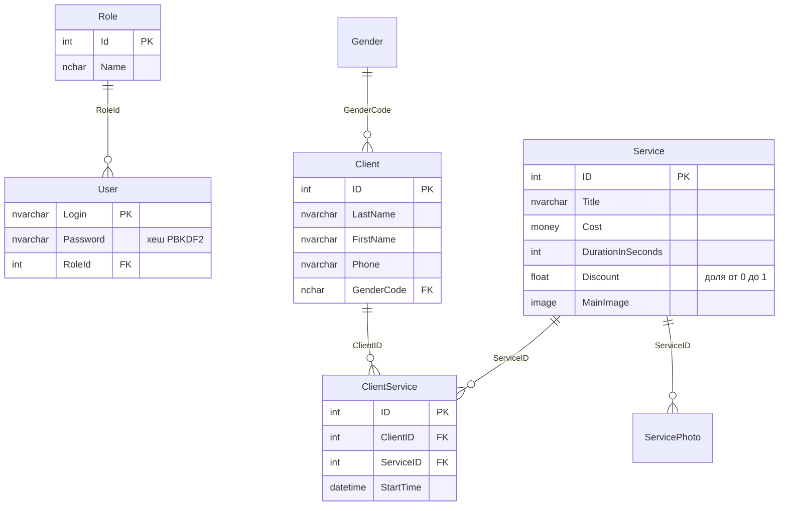

<div align="center">


# Car Service

**Настольное приложение для ведения каталога услуг автосервиса**

[](https://github.com/Kickfok/CarService/actions/workflows/build.yml)
[](https://github.com/Kickfok/CarService/releases/latest)


[](LICENSE)

[Возможности](#возможности) •
[Скриншоты](#скриншоты) •
[Быстрый старт](#быстрый-старт) •
[Архитектура](#архитектура) •
[Руководство пользователя](docs/USER_GUIDE.md)

</div>

---

## О проекте

Car Service - приложение на WPF для сотрудников автосервиса. Оно показывает каталог услуг с ценами, скидками
и изображениями, позволяет искать и фильтровать услуги, а администратору - добавлять, редактировать и удалять их.
Данные хранятся в Microsoft SQL Server, доступ к ним выполняется через Entity Framework 6 (подход Database First).

Проект выполнен в рамках учебной практики (УП 05.01).

## Возможности

| | Функция | Администратор | Пользователь |
|---|---|:---:|:---:|
| 🔐 | Вход по логину и паролю, пароли хранятся в виде хешей PBKDF2 | ✅ | ✅ |
| 📋 | Каталог услуг: цена, длительность, скидка, изображение | ✅ | ✅ |
| 🔎 | Поиск по названию, фильтр по размеру скидки, сортировка по цене | ✅ | ✅ |
| ➕ | Добавление услуги с проверкой введенных данных | ✅ | - |
| ✏️ | Редактирование услуги и замена изображения | ✅ | - |
| 🗑️ | Удаление услуги (запрещено, если на нее записаны клиенты) | ✅ | - |

Дополнительно:

- услуги со скидкой выделяются зеленым фоном, старая цена зачеркнута;
- над списком отображается счетчик "Показано N из M";
- горячие клавиши: `Enter` - войти, `F11` - обычный размер окна, `F12` - на весь экран, `Esc` - выход.

## Скриншоты

<table>
  <tr>
    <td align="center"><br><sub>Авторизация</sub></td>
    <td align="center"><br><sub>Список услуг: администратор</sub></td>
  </tr>
  <tr>
    <td align="center"><br><sub>Редактирование услуги</sub></td>
    <td align="center"><br><sub>Список услуг: пользователь, только просмотр</sub></td>
  </tr>
  <tr>
    <td align="center"><br><sub>Проверка введенных данных</sub></td>
    <td align="center"><br><sub>Защита от удаления услуги с записями</sub></td>
  </tr>
</table>

## Быстрый старт

### Готовая сборка

1. Скачайте `CarService-<версия>.zip` со страницы [последнего релиза](https://github.com/Kickfok/CarService/releases/latest) и распакуйте.
2. В распакованной папке выполните в PowerShell:
   ```powershell
   powershell -ExecutionPolicy Bypass -File database\Setup-Database.ps1
   ```
3. Запустите `app\CarService.exe`.

Нужны .NET Framework 4.7.2+ (есть в Windows 10 и 11), SQL Server LocalDB и `sqlcmd`.

### Сборка из исходников

#### Требования

- Windows 10 или 11;
- [Visual Studio 2019 или новее](https://visualstudio.microsoft.com/) с рабочей нагрузкой **"Разработка классических приложений .NET"**;
- SQL Server LocalDB (ставится вместе с Visual Studio) либо любой другой экземпляр SQL Server 2012+;
- утилита `sqlcmd` (входит в SQL Server Management Studio и в состав Visual Studio).

#### 1. Клонирование

```bash
git clone https://github.com/Kickfok/CarService.git
```

#### 2. Создание базы данных

Скрипт создает базу `CarService` в LocalDB и наполняет ее тестовыми данными: 17 услуг с изображениями,
клиенты, записи на услуги и две учетные записи.

```powershell
cd CarService\database
powershell -ExecutionPolicy Bypass -File .\Setup-Database.ps1
```

Ключ `-ExecutionPolicy Bypass` разрешает выполнить скрипт только в этом запуске и не меняет настройки системы.

Другой сервер, ручной запуск SQL-скриптов и пересоздание базы описаны в [database/README.md](database/README.md).

#### 3. Запуск

Откройте `CarService.sln` в Visual Studio и нажмите `F5`. NuGet-пакеты восстановятся автоматически.

Сборка из командной строки (Developer PowerShell for VS):

```powershell
msbuild CarService.sln -t:restore -p:RestorePackagesConfig=true
msbuild CarService.sln -p:Configuration=Release
.\CarService\bin\Release\CarService.exe
```

### Учетные записи

| Роль | Логин | Пароль |
|---|---|---|
| Администратор | `admin1` | `admin1` |
| Пользователь | `user1` | `user1` |

> [!WARNING]
> Это тестовые учетные записи для демонстрации. Не используйте их в реальной базе.

### Подключение к другому серверу

Строка подключения находится в [CarService/App.config](CarService/App.config) (`CarServiceEntities`).
По умолчанию используется `(localdb)\MSSQLLocalDB` с проверкой подлинности Windows. Для SQL Server Express
замените `data source=(localdb)\MSSQLLocalDB` на `data source=.\SQLEXPRESS`.

## Архитектура

### Структура решения

```
CarService/
├── CarService/                     # WPF-приложение
│   ├── Entities/                   # Модель EF (CarServiceModel.edmx) и сгенерированные сущности
│   │   └── ServicePartial.cs       # Вычисляемые свойства услуги для отображения
│   ├── Pages/
│   │   ├── LoginPage.xaml          # Авторизация
│   │   ├── ServicesPage.xaml       # Список услуг, поиск, фильтры
│   │   └── AddEditServicePage.xaml # Добавление и редактирование услуги
│   ├── Dictionaries/               # Общие стили
│   ├── MainWindow.xaml             # Главное окно с навигацией (Frame)
│   ├── App.xaml.cs                 # Контекст БД и текущий пользователь
│   └── Roles.cs                    # Идентификаторы ролей
├── UserRegistration/               # Библиотека: хеширование паролей и оценка их сложности
├── UserRegistration.Tests/         # Модульные тесты библиотеки (MSTest)
├── database/                       # SQL-скрипты, тестовые данные и скрипт установки БД
└── docs/                           # Руководство пользователя и скриншоты
```

### Навигация



### Основные таблицы



Полная схема (16 таблиц, включая товары, продажи и теги клиентов) - в [database/01-schema.sql](database/01-schema.sql).

### Хранение паролей

Пароли хранятся не открытым текстом, а в виде строки
`PBKDF2$SHA256$<итерации>$<соль>$<хеш>` (100 000 итераций, случайная соль 16 байт).
Реализация - [UserRegistration/PasswordHasher.cs](UserRegistration/PasswordHasher.cs).
Хеш для нового пользователя можно получить так:

```powershell
Add-Type -Path .\UserRegistration\bin\Debug\net472\UserRegistration.dll
[UserRegistration.PasswordHasher]::Hash('новый_пароль')
```

## Тесты

Модульные тесты покрывают хеширование паролей и оценку их сложности (23 теста).
В Visual Studio: **Тест → Запустить все тесты**. Из командной строки:

```powershell
vstest.console.exe .\UserRegistration.Tests\bin\Debug\UserRegistration.Tests.dll
```

При каждом push и pull request тесты запускаются в [GitHub Actions](.github/workflows/build.yml).

## Релизы и NuGet-пакет

Релиз собирается автоматически workflow [release.yml](.github/workflows/release.yml) при отправке тега `vX.Y.Z`:

```bash
git tag v1.1.0
git push origin v1.1.0
```

Workflow проставляет версию, собирает решение, прогоняет тесты и публикует:

- [релиз](https://github.com/Kickfok/CarService/releases) с архивом `CarService-X.Y.Z.zip` (программа, скрипты БД, документация) и описанием из [CHANGELOG.md](CHANGELOG.md);
- [NuGet-пакет](https://github.com/Kickfok/CarService/pkgs/nuget/CarService.UserRegistration) `CarService.UserRegistration` в GitHub Packages: хеширование паролей и оценка их сложности ([описание пакета](UserRegistration/README.md)).

## Технологии

- **C# 7.3, .NET Framework 4.7.2**
- **WPF**: страницы и навигация через `Frame`, стили в `ResourceDictionary`
- **Entity Framework 6.2**: Database First, модель `.edmx` с генерацией сущностей из T4-шаблонов
- **Microsoft SQL Server / LocalDB**
- **MSTest 2**: модульные тесты

## История изменений

См. [CHANGELOG.md](CHANGELOG.md).

## Лицензия

Проект распространяется по лицензии MIT, подробнее - в файле [LICENSE](LICENSE).
